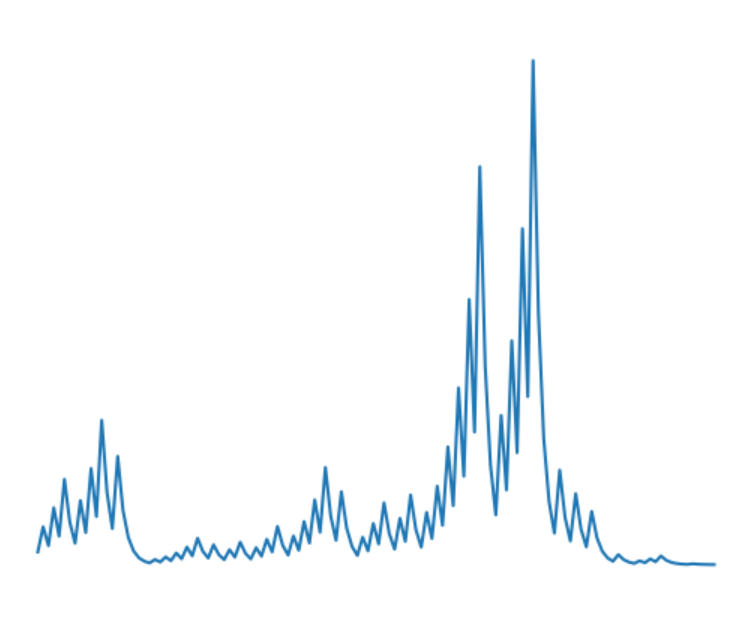

# Collatz Visualizer

<!-- ABOUT THE PROJECT -->
## About

A visualizer for the Collatz conjecture developed in Python.

The Collatz conjecture is a conjecture in mathematics that concerns sequences defined as follows: start with any positive integer n. Then each term is obtained from the previous term as follows: if the previous term is even, the next term is one half of the previous term. If the previous term is odd, the next term is 3 times the previous term plus 1. The conjecture is that no matter what value of n, the sequence will always reach 1. [More info](https://en.wikipedia.org/wiki/Collatz_conjecture)

<!-- GETTING STARTED -->
## Getting Started

You must have Python 3 along with the matplotlib library to run the app. Download and run the collatz_visualizer.py file.

<!-- USAGE EXAMPLES -->
## Usage

When prompted in the command window, enter the number you wish be visualized using the Collatz conjecture.

Example result for the number 231:

<!-- CONTACT -->
## Contact

Gaurav Garre: [gauravgarre@gmail.com](mailto:gauravgarre@gmail.com)

Project Link: [https://github.com/gauravgarre/collatz-visualizer](https://github.com/gauravgarre/collatz-visualizer)

